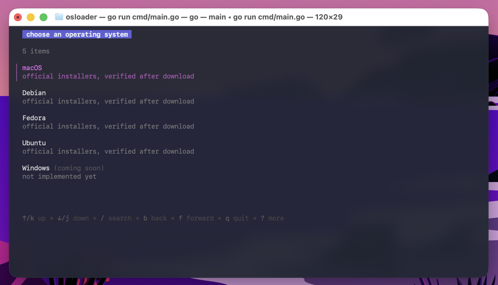

# osloader

Find official OS installers, download them fast, and verify that what landed on
disk really is the vendor's file.



| OS | Source | What proves the file |
|---|---|---|
| macOS | Apple's Software Update catalog | `pkgutil` signature, Apple Root CA chain |
| Debian | cdimage.debian.org | SHA-256 from the signed `SHA256SUMS` |
| Ubuntu | releases.ubuntu.com, cdimage.ubuntu.com | SHA-256 from the signed `SHA256SUMS` |
| Fedora | fedoraproject.org `releases.json` | SHA-256 and size published by Fedora |
| Windows | - | registered, not implemented yet |

Operating systems are not alike, so each one asks its own questions: Apple ships
one installer per release, while Debian builds every image for several
architectures in CD and DVD sizes. A provider declares those questions as
*facets*, the picker turns each into a page, and the CLI exposes them as
`--filter key=value`. Questions that shape the list (architecture, image size)
come before it; questions that shape the download (which mirror) come after you
have chosen a release.

```bash
go build -o osloader ./cmd && ./osloader
go run ./cmd list            # or: go run cmd/main.go list
```

Builds are published for Linux (amd64, arm64), Windows (amd64, arm64) and
macOS (arm64), with a `SHA256SUMS` alongside them.

The macOS build is not signed with an Apple Developer ID, so a binary downloaded
through a browser is quarantined and Gatekeeper refuses to run it. Either fetch
it without the browser, which never sets the quarantine flag:

```bash
curl -L https://github.com/ryanparsa/osloader/releases/latest/download/osloader_v0.1.0_darwin_arm64.tar.gz | tar xz
```

or clear the flag on what you already downloaded:

```bash
xattr -d com.apple.quarantine ./osloader
```

Building it yourself (`go build ./cmd`) avoids the question entirely.

(`go install github.com/ryanparsa/osloader/cmd@latest` installs it as `cmd` -
move the package to `cmd/osloader/` if you want that name to be `osloader`.)

## Use it

```bash
osloader                                   # interactive picker
osloader list                              # table of available installers
osloader list --sort size --reverse        # date (default), version, size, name
osloader list --channel beta --json
osloader download --version 27.0           # pick by version (27 → newest 27.x)
osloader download --build 26A428 --out ~/Downloads --connections 12
osloader url --version 27.0                # just print the URL

osloader list --os debian --filter arch=arm64 --filter media=cd
osloader list --os ubuntu --filter arch=amd64 --filter variant=desktop
osloader list --os fedora --filter variant=Workstation
osloader download --os debian --product debian-13.7.0-amd64-netinst.iso
osloader download --os ubuntu --product ubuntu-24.04.5.1-desktop-amd64.iso
```

Flags that apply everywhere: `--os`, `--channel` (`public`, `devseed`, `beta`,
`customerseed`), `--out` (defaults to the current directory), `--connections`
(max 16), `--limit-rate 20M`, `--catalog-url`, `--user-agent`, `-v/--verbose`, and `--mirror` (repeatable) on
`download`.

`--build`, `--version` and `--product` can be combined, and all of them must
match. That makes a fully specified command unambiguous: the TUI prints one for
every download, so the exact file can be scripted or sent to someone else -

```
osloader download --os macos --channel public --product 142-15488 --version 27.0 --build 26A428
```

If a selector matches several releases, the newest is used and the choice is
reported on stderr.

In the release list, `s` cycles the sort - date, version, size, name - and `r`
reverses it. The header shows the current order, and the cursor stays on the
release you had selected.

`--user-agent` takes `default` (identifies osloader), `browser` (a current
desktop Chrome string), or any literal string you pass.

There is no config file: defaults live in code, and everything is a flag or a
choice in the TUI.

## Downloading

The transfer is split into up to 16 byte ranges fetched in parallel and written
straight to their offsets in a pre-allocated file. Memory use is fixed - one
256 KiB buffer per connection - so a 17 GiB installer costs the same RAM as a
small one.

Where a download comes from is the tool's problem, not a menu the user has to
answer. Debian publishes around ninety mirrors and no way to know which is near
this machine, so before a Debian download starts, every mirror is timed against
the file itself - a 16 KiB latency screen across all of them, then a 256 KiB
throughput read from the quickest ten - and those ten become the sources. Ubuntu
serves its own images and Fedora redirects each request to a nearby mirror, so
neither needs measuring.

With more than one source, each is probed before use and dropped if it serves a
different size or refuses ranges; chunks from two different files would corrupt
the result. Connections spread across the healthy sources, a definitive failure
(403, 404) retires that source and the chunk carries on elsewhere, and three
consecutive failures retire it for the rest of the run. Public mirrors are not
CDNs, so each host gets at most four connections. `--mirror <url>` adds a source
by hand on any OS.

The download screen gives each connection its own line - the chunk it holds,
how far into it, and its own speed - so one stalled connection is obvious while
the others keep moving. `--verbose` adds an event log: preflight, chunk plan,
each chunk start and finish, retries with their cause, stalls, and every
verification check. On the CLI it streams to stderr (stdout stays pipeable);
in the TUI the last few lines appear under the connections. When a file has
several mirrors, each connection also shows which host it is reading from.

Every list page can be searched: `/` opens a search box and the status bar
shows the match count - which is how you get through ninety mirrors or a
catalogue of images. In the picker, `b` goes back and `f` goes forward, like a browser - the
page comes back with its cursor where you left it, and a catalog that arrives
after you have moved on is ignored. `q` during a download stops it, waits for
the resume state to be written, and then prints where it got to and the command
that finishes the job:

```
download stopped at 33% (5.6 GiB of 17.1 GiB, kept in ./macOS_27.0_26A428_InstallAssistant.pkg.part)
resume with: osloader download --os macos --channel public --product 142-15488 --version 27.0 --build 26A428
```

Progress is recorded in a sidecar next to the partial file:

```
macOS_27.0_26A428_InstallAssistant.pkg.part
macOS_27.0_26A428_InstallAssistant.pkg.part.json
```

Interrupt with Ctrl-C (or `q` in the TUI) and run the same command again: each
range continues from its saved offset. If the server's ETag, size or
modification time has moved, the saved bytes belong to a different file and are
discarded rather than mixed in. Stalled connections are dropped after 60s,
transient failures (5xx, 429, resets) are retried with backoff, and a server
that ignores `Range` falls back to a single stream.

## Verifying

A download only gets its real file name after its checks pass. What "verified"
means depends on what the vendor publishes, and the report always says which
check did the work.

**macOS** - the installer is a signed package from a single Apple CDN:

1. **Size** matches the catalog and the server's `Content-Length`.
2. **Provenance** - HTTPS, and every redirect hop stays on Apple's hosts.
3. **SHA-256** computed and shown. Informational only: Apple publishes no
   per-file hash to compare against (the catalog `Digest` is not a file hash).
4. **Signature** - `pkgutil --check-signature` must report an Apple-trusted
   chain ending in Apple Root CA.

**Debian, Ubuntu and Fedora** - images come from mirror networks, so the
transport proves nothing and the digest proves everything:

1. **SHA-256** must match what the project published: Debian's and Ubuntu's
   `SHA256SUMS` (signed alongside as `SHA256SUMS.gpg`), or Fedora's
   `releases.json`, each read over HTTPS from the project's own origin. A
   mismatch is fatal.
2. **Size** is a second gate where the project publishes one (Fedora does);
   Debian and Ubuntu publish digests rather than byte counts, so the size is
   reported for information.

A file that fails is kept as `<name>.unverified` and the command exits non-zero.
On macOS off-platform the signature step cannot run and says so - it is never
reported as a pass. `--no-verify` skips the lot, and is not recommended.

## Adding an OS

Implement `provider.Provider` (`Name`, `Available`, `Channels`, `Facets`,
`List`, `Resolve`) in `internal/provider/<os>` and register it from `init`.
Declare whatever questions that OS needs as facets, and return an `Artifact`
with the download URL, any mirrors, the hosts it may come from, and a
`verify.Verifier` - `verify.ApplePkg` for a signed package, `verify.Checksum`
for a published digest. The TUI, the CLI and the download engine need no
changes.

## Layout

```
cmd/main.go          entry point
internal/cli/        cobra commands
internal/tui/        Bubble Tea picker and progress view
internal/provider/   Provider interface, facets, registry
                     macos/, debian/, ubuntu/, fedora/, windows/, webdir/
internal/download/   chunk planner, workers, resume state, progress
internal/verify/     size, sha256, pkgutil signature (darwin build tag)
internal/format/     byte, rate and duration rendering
internal/logging/    compact verbose log + ring buffer for the TUI
internal/ua/         User-Agent strings
```
